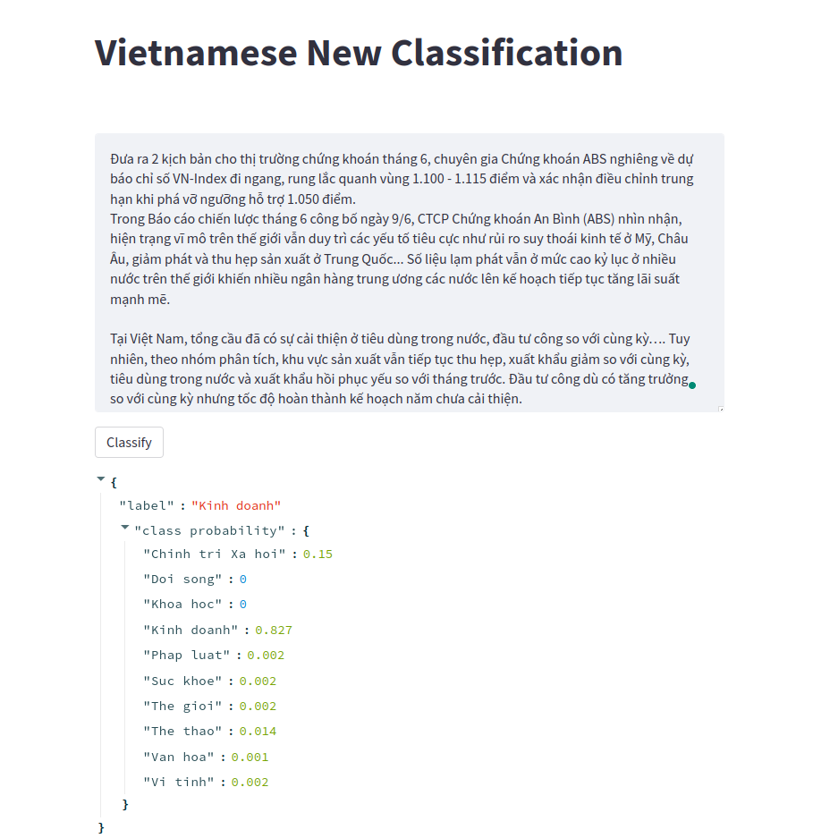

# Vietnamese New Classification

## Getting Started

This is an example of how you may give instructions on setting up your project locally.
To get a local copy up and running follow these simple example steps.

### Prerequisites and installation

You can use ``pip`` or ``conda`` to install neccessary packages.
* **pip**
    ```sh
    python3 -m venv venv
    source activate venv
    pip install -U pip
    pip install -r requirements.txt
    ```
or
* **conda**
    ```bash
    conda create --name venv python=3.8.10
    conda activate venv
    conda install --file requirements.txt
    ```

## Usage

```bash
$ streamlit run main.py
```
You can now view the Streamlit app in your browser at: `http://localhost:8501` as the follow figure:
